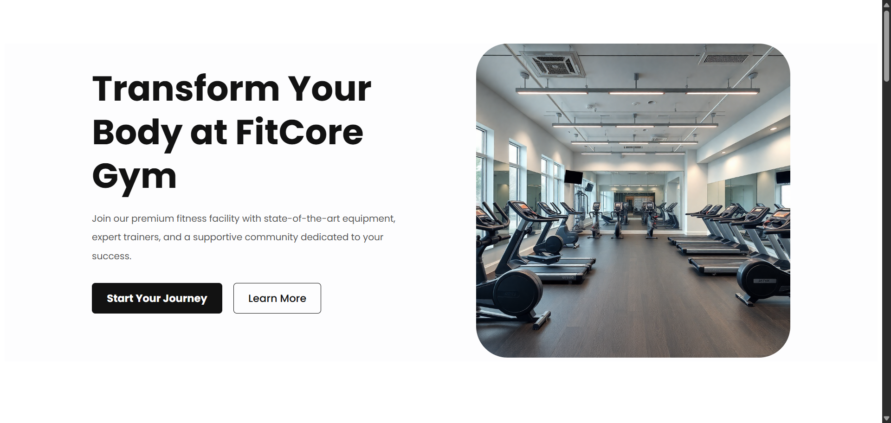
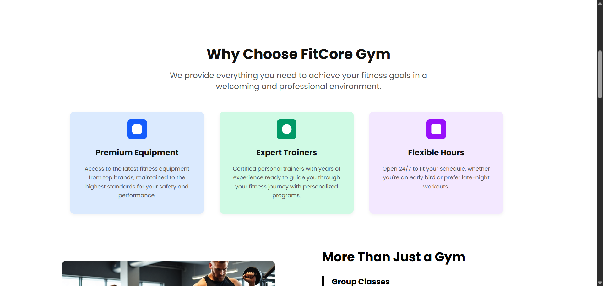
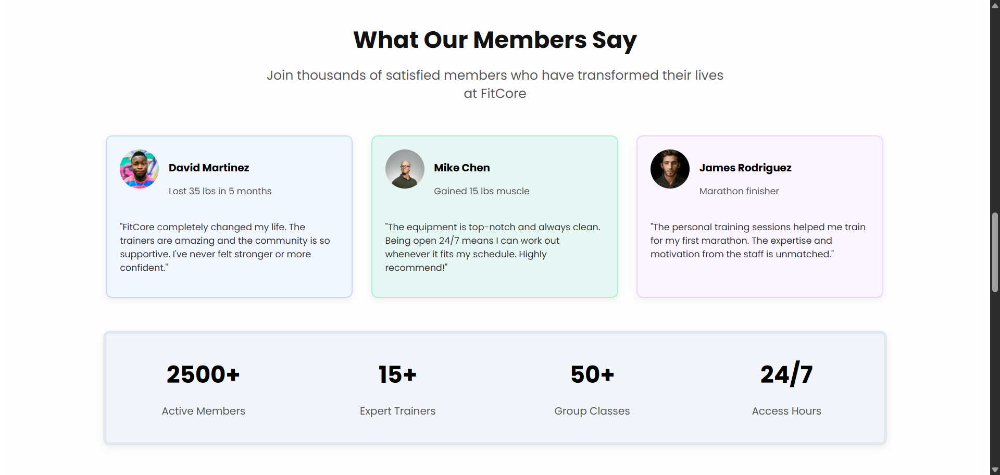
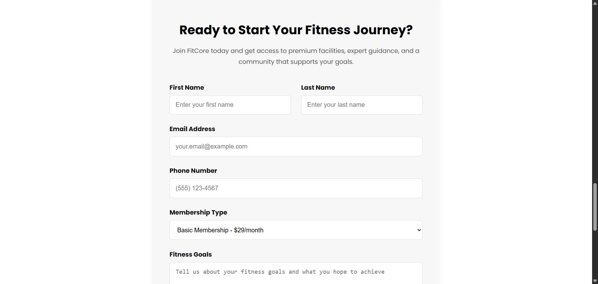
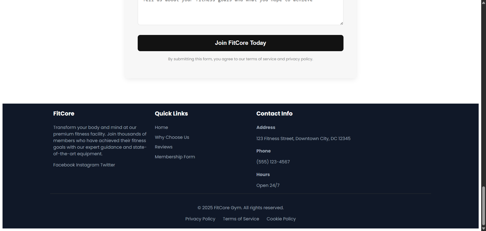

# Product Landing Page: FitCore Gym

## 📝 Overview

This project is a static landing page for a fictional gym named "FitCore Gym." The page was built using only HTML and CSS, with a primary focus on applying fundamental web design concepts, especially building a layout using `float` and managing element flow with a `clear-fix` utility.

**Goal:** To practice building a complete web page from scratch using traditional layout techniques (Floats) and to gain a practical understanding of the Box Model.

## ✨ Page Features

* **Hero Section:** A main showcase for the service with a clear title, description, and Call-to-Action buttons.
* **"Why Choose Us" Section:** A 3-column layout displaying the gym's main advantages (Premium Equipment, Expert Trainers, Flexible Hours).
* **"More Than Just a Gym" Section:** A 2-column layout (image on the left, bullet points on the right) showcasing additional services like group classes and nutrition guidance.
* **Testimonials Section:** Displays customer reviews in a 3-card layout.
* **Stats Bar:** Shows 4 key gym statistics (Members, Trainers, etc.) in a 4-column layout.
* **Reservation Form:** A cleanly designed, centered form for new members to register.
* **Multi-Column Footer:** A 3-column footer containing information about the gym, quick links, and contact info.
* **Layout using Float:** The primary column structure in all page sections was built using the `float` property, relying on a `clear-fix` class to ensure a proper, non-overlapping layout.

## 🛠️ Tech Stack

* **HTML5:** The markup language used for building the page structure.
* **CSS3 (Vanilla):** Used for all styling and layout implementation, with a focus on:
    * `float` & `clear` (for building the layout).
    * Box Model (`margin`, `padding`, `border`).
    * `box-shadow` (for card shadow effects).
    * `border-radius` (for rounded corners).
    * Pseudo-elements (like `::after` in the `clearfix` technique).

## 📸 App Visualization







**Watch the Demo:** [Link to Demo Video](https://drive.google.com/drive/u/0/folders/1zp9GLH3gBmG6KscAAvnla7ZOrpZSlW0T)

## 🚀 Getting Started

To run the project on your local machine for development or testing purposes, follow these steps:

### Prerequisites

* A modern web browser (like Google Chrome, Firefox).
* A code editor (like VS Code) if you wish to modify the code.

### Running

1.  **Clone the repository:**
    ```bash
    git clone [https://github.com/Rawwann/fit-core-gym.git](https://github.com/Rawwann/fit-core-gym.git)
    ```

2.  **Navigate to the project directory:**
    ```bash
    cd fit-core-gym
    ```

3.  **Open the `index.html` file:**
    * Open the `HTML/index.html` file (since your HTML file is inside an `HTML` folder) directly in your web browser.
    * (This project is a static page and requires no installation or build steps).

## 🤝 Contributing

This project was created as part of a learning exercise. If you have suggestions for improving the code or fixing bugs, feel free to fork the repository and submit a Pull Request.

## 📄 License

This project is licensed under the MIT License.